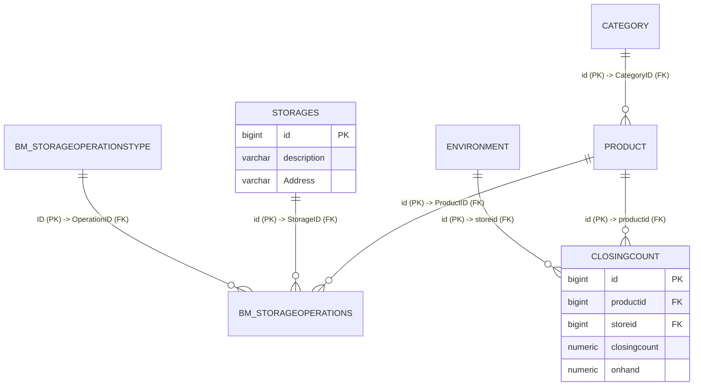

```mermaid
erDiagram
    %% Связи для остатков
    PRODUCT ||--o{ BM_STORAGEOPERATIONS : "id (PK) -> ProductID (FK)"
    STORAGES ||--o{ BM_STORAGEOPERATIONS : "id (PK) -> StorageID (FK)"
    BM_STORAGEOPERATIONSTYPE ||--o{ BM_STORAGEOPERATIONS : "ID (PK) -> OperationID (FK)"
    
    PRODUCT ||--o{ CLOSINGCOUNT : "id (PK) -> productid (FK)"
    ENVIRONMENT ||--o{ CLOSINGCOUNT : "id (PK) -> storeid (FK)"
    
    CATEGORY ||--o{ PRODUCT : "id (PK) -> CategoryID (FK)"

    %% Описание таблиц
    CLOSINGCOUNT {
        bigint id PK
        bigint productid FK
        bigint storeid FK
        numeric closingcount
        numeric onhand
    }
    STORAGES {
        bigint id PK
        varchar description
        varchar Address
    }
```