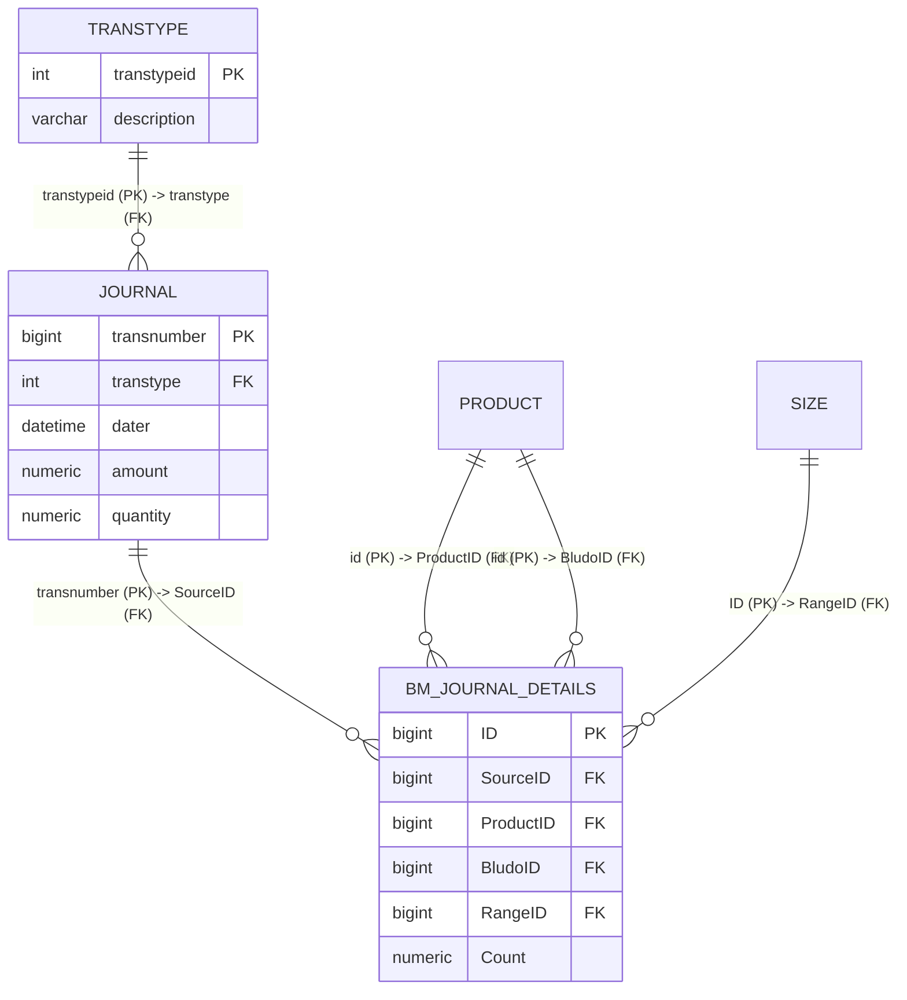

```mermaid

erDiagram
    %% Связи для продаж
    TRANSTYPE ||--o{ JOURNAL : "transtypeid (PK) -> transtype (FK)"
    JOURNAL ||--o{ BM_JOURNAL_DETAILS : "transnumber (PK) -> SourceID (FK)"
    
    PRODUCT ||--o{ BM_JOURNAL_DETAILS : "id (PK) -> ProductID (FK)"
    PRODUCT ||--o{ BM_JOURNAL_DETAILS : "id (PK) -> BludoID (FK)"
    SIZE ||--o{ BM_JOURNAL_DETAILS : "ID (PK) -> RangeID (FK)"

    %% Описание таблиц
    JOURNAL {
        bigint transnumber PK
        int transtype FK
        datetime dater
        numeric amount
        numeric quantity
    }
    BM_JOURNAL_DETAILS {
        bigint ID PK
        bigint SourceID FK
        bigint ProductID FK
        bigint BludoID FK
        bigint RangeID FK
        numeric Count
    }
    TRANSTYPE {
        int transtypeid PK
        varchar description
    }
```