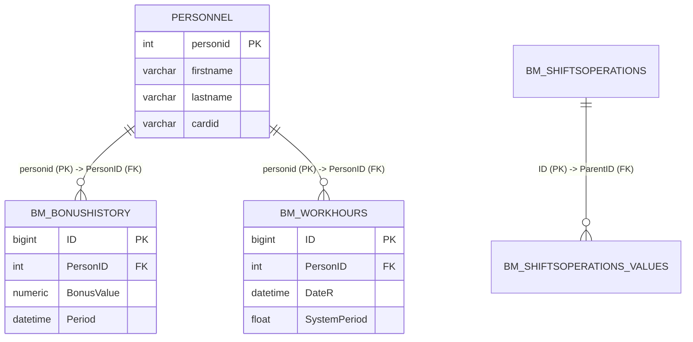

```mermaid
erDiagram
    %% Связи для персонала
    PERSONNEL ||--o{ BM_BONUSHISTORY : "personid (PK) -> PersonID (FK)"
    PERSONNEL ||--o{ BM_WORKHOURS : "personid (PK) -> PersonID (FK)"
    BM_SHIFTSOPERATIONS ||--o{ BM_SHIFTSOPERATIONS_VALUES : "ID (PK) -> ParentID (FK)"

    %% Описание таблиц
    PERSONNEL {
        int personid PK
        varchar firstname
        varchar lastname
        varchar cardid
    }
    BM_BONUSHISTORY {
        bigint ID PK
        int PersonID FK
        numeric BonusValue
        datetime Period
    }
    BM_WORKHOURS {
        bigint ID PK
        int PersonID FK
        datetime DateR
        float SystemPeriod
    }
```