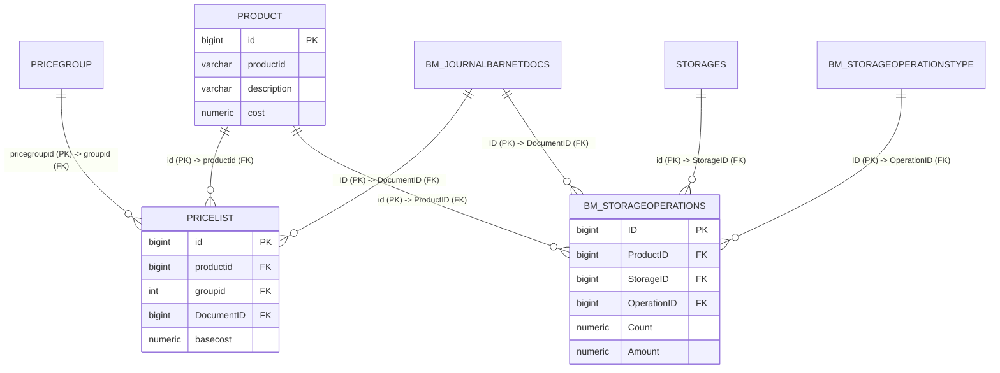

```mermaid

erDiagram
    %% Связи для закупок
    PRODUCT ||--o{ PRICELIST : "id (PK) -> productid (FK)"
    PRICEGROUP ||--o{ PRICELIST : "pricegroupid (PK) -> groupid (FK)"
    BM_JOURNALBARNETDOCS ||--o{ PRICELIST : "ID (PK) -> DocumentID (FK)"
    
    PRODUCT ||--o{ BM_STORAGEOPERATIONS : "id (PK) -> ProductID (FK)"
    STORAGES ||--o{ BM_STORAGEOPERATIONS : "id (PK) -> StorageID (FK)"
    BM_STORAGEOPERATIONSTYPE ||--o{ BM_STORAGEOPERATIONS : "ID (PK) -> OperationID (FK)"
    BM_JOURNALBARNETDOCS ||--o{ BM_STORAGEOPERATIONS : "ID (PK) -> DocumentID (FK)"

    %% Описание таблиц (ключевые поля)
    PRODUCT {
        bigint id PK
        varchar productid
        varchar description
        numeric cost
    }
    PRICELIST {
        bigint id PK
        bigint productid FK
        int groupid FK
        bigint DocumentID FK
        numeric basecost
    }
    BM_STORAGEOPERATIONS {
        bigint ID PK
        bigint ProductID FK
        bigint StorageID FK
        bigint OperationID FK
        numeric Count
        numeric Amount
    }
```