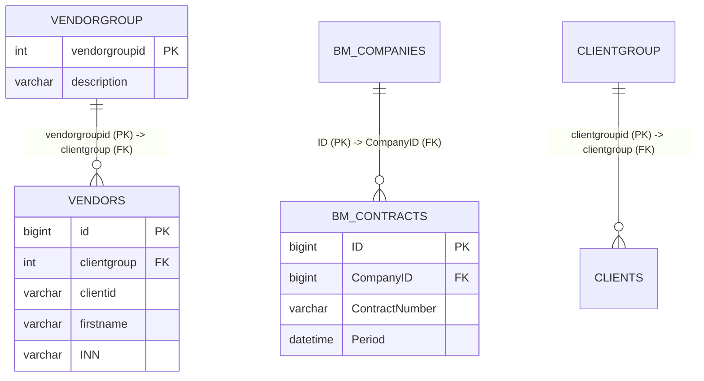

```mermaid
erDiagram
    %% Связи для поставщиков
    VENDORGROUP ||--o{ VENDORS : "vendorgroupid (PK) -> clientgroup (FK)"
    BM_COMPANIES ||--o{ BM_CONTRACTS : "ID (PK) -> CompanyID (FK)"
    CLIENTGROUP ||--o{ CLIENTS : "clientgroupid (PK) -> clientgroup (FK)"

    %% Описание таблиц
    VENDORS {
        bigint id PK
        int clientgroup FK
        varchar clientid
        varchar firstname
        varchar INN
    }
    VENDORGROUP {
        int vendorgroupid PK
        varchar description
    }
    BM_CONTRACTS {
        bigint ID PK
        bigint CompanyID FK
        varchar ContractNumber
        datetime Period
    }
```